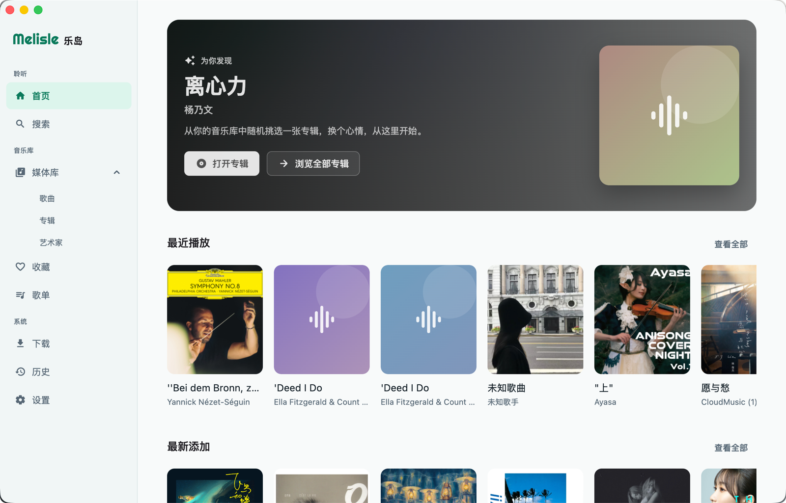
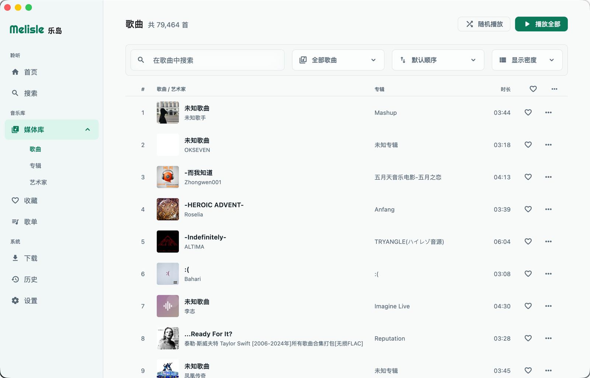
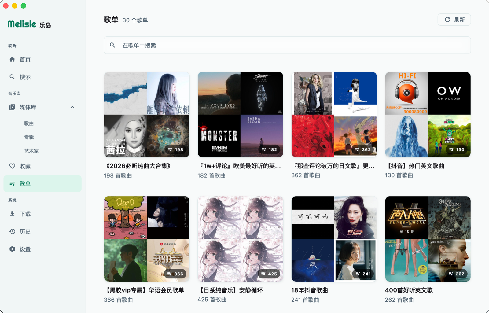
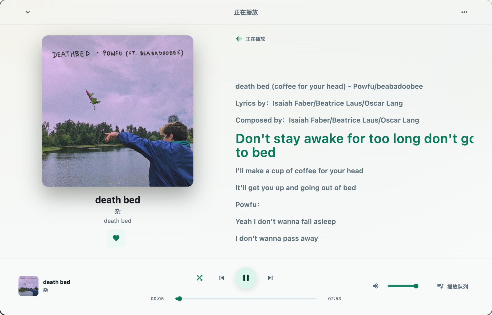

# 乐岛（Melisle）

> 听见每一份热爱。

[](https://github.com/Leeero/melisle/releases/latest)
[](https://github.com/Leeero/melisle/actions/workflows/master-release.yml)
[](https://github.com/Leeero/melisle/stargazers)
[](LICENSE)

乐岛（Melisle）是一款使用 Flutter 构建的跨平台自托管音乐播放器，让 Emby、Navidrome 和 Subsonic/OpenSubsonic 音乐库拥有接近现代流媒体客户端的浏览与聆听体验。

它面向 Android、iOS、macOS 和 Windows，以统一的 `MusicRepository` 抽象屏蔽后端差异，并在本地维护设置、播放历史、搜索历史和离线下载记录。项目采用 PolyForm Noncommercial 许可证公开源代码，允许个人和其他非商业用途。

[下载最新版本](https://github.com/Leeero/melisle/releases/latest) · [报告问题](https://github.com/Leeero/melisle/issues/new/choose) · [参与贡献](CONTRIBUTING.md)

## 界面预览

以下截图来自 macOS 客户端的真实运行环境，展示浅色主题下的主要页面。

| 首页 | 歌曲媒体库 |
| --- | --- |
|  |  |
| 个性推荐、最近播放与最新添加 | 搜索、筛选、排序与歌曲列表 |

| 歌单 | 正在播放 |
| --- | --- |
|  |  |
| 歌单搜索与封面网格 | 专辑封面、同步歌词与播放控制 |

## 核心特性

- **统一连接自托管音乐库**：支持 Emby、Navidrome 及 Subsonic/OpenSubsonic API 兼容服务，自动探测失败时可手动选择服务类型。
- **完整的聆听体验**：播放队列、循环与随机模式、同步歌词、歌词偏移、封面氛围和睡眠定时器。
- **跨平台与桌面集成**：覆盖 Android、iOS、macOS 和 Windows，并支持系统媒体控制、桌面托盘与键盘快捷键。
- **离线与音质控制**：支持自定义下载目录、下载队列、本地文件优先播放以及多档在线和下载音质。
- **面向大型音乐库**：提供歌曲、专辑、歌手、歌单、收藏、历史与全局搜索，并支持排序、筛选和分页加载。

## 下载

预构建版本发布在 [GitHub Releases](https://github.com/Leeero/melisle/releases/latest)：

| 平台 | 产物 | 使用说明 |
| --- | --- | --- |
| Android | `.apk` | 下载后允许系统安装来自浏览器或文件管理器的应用 |
| Windows | `.exe` | 运行安装程序完成安装 |
| macOS | `.dmg` | 打开镜像并安装；未签名版本可能需要在系统设置中手动允许 |
| iOS | `.ipa` | 构建产物未签名，不能直接安装，需要使用自己的 Apple ID 重新签名 |

> 乐岛不提供音乐内容或服务器。使用前需要准备自己的 Emby、Navidrome 或 Subsonic/OpenSubsonic 兼容服务。

## 当前状态

| 项目 | 状态 |
| --- | --- |
| 可运行平台 | Android / iOS / macOS / Windows |
| 当前可用后端 | Emby API、Navidrome / Subsonic API 兼容服务 |
| 登录方式 | 输入服务器、用户名、密码或 API Token；默认自动探测，也可在失败后手动选择后端类型 |
| 未完成后端 | WebDAV / NAS 目前只有仓库骨架，尚未接入启动流程 |
| UI 语言 | 简体中文 |
| 许可证 | PolyForm Noncommercial 1.0.0，源码可见但禁止商用 |

## 已实现功能

- 账号登录、会话安全存储、启动时自动恢复登录态。
- 首页推荐，包括最新专辑、随机专辑、最近播放和常听内容。
- 媒体库浏览：歌曲、专辑、歌手、歌单、收藏。
- 专辑详情、歌手详情、歌单详情。
- 全局搜索，覆盖歌曲、专辑、歌手和歌单，并记录本地搜索历史。
- 播放器：播放 / 暂停、上一曲 / 下一曲、进度拖动、音量、播放队列、队列重排、移除和清空。
- 播放模式：顺序播放、列表循环、单曲循环、随机播放。
- 在线音质：自动、无损、高品质 320K、标准 192K、省流 128K。
- 歌词：同步歌词展示、当前行高亮、歌词点击跳转、歌词偏移调节、自定义歌词来源。
- 封面：服务端封面展示、自定义封面来源、封面调色背景。
- 收藏歌曲 / 专辑 / 歌手；Emby 额外支持同步收藏歌单。
- 播放历史本地记录，并向后端汇报播放开始、进度和结束；Subsonic API 使用 scrobble。
- 离线下载：串行下载队列、进度展示、取消、删除、本地文件优先播放、自定义下载目录。
- 睡眠定时器：倒计时停止或本曲结束后停止。
- 设置：主题模式、默认音质、曲间间隔、自定义歌词与封面来源、下载管理。
- 系统播放能力：基于 `audio_service` 支持通知、锁屏和系统媒体控制。
- 桌面集成：macOS / Windows 窗口初始化、托盘菜单；Windows 支持全局快捷键和关闭后最小化到托盘。
- 应用内键盘快捷键：空格播放 / 暂停，方向键切歌和调音量，`S` 随机，`R` 循环，`L` 切换播放模式，`Ctrl+J/K` 调整歌词偏移。

## 技术栈

- Flutter / Dart
- `flutter_bloc`：页面和业务状态管理
- `go_router`：路由与登录态重定向
- `just_audio` + `audio_service`：播放内核、后台播放和系统媒体能力
- `dio`：Emby / Subsonic API 请求与离线文件下载
- `drift` + SQLite：播放历史、搜索历史、应用设置、下载记录
- `flutter_secure_storage`：登录会话安全存储
- `window_manager`、`tray_manager`、`hotkey_manager`：桌面窗口、托盘和快捷键
- `cached_network_image`、`palette_generator`：封面缓存与颜色提取

## 架构

项目按 Clean Architecture 风格分层：

```text
lib/
├── bootstrap/        # 应用启动、依赖组装、路由、桌面集成
├── domain/           # 领域实体、播放队列、歌词同步、仓库契约
├── application/      # 用例层
├── infrastructure/   # Emby / Subsonic 适配、缓存、数据库、音频、持久化
├── presentation/     # 页面、Cubit、组件
└── shared/           # 主题、常量、设计 token
```

核心约束：

- `MusicRepository` 保持后端无关。
- `presentation → application → domain ← infrastructure`，领域层不依赖 Flutter。
- 新后端应通过 infrastructure 适配 `MusicRepository`，不要把后端专有逻辑泄漏到 domain 或 presentation。

## 本地开发

环境要求：

- Flutter Stable，Dart SDK 需满足 `pubspec.yaml` 中的 `^3.11.5` 约束。
- macOS / Windows 桌面开发需要安装对应平台工具链。
- iOS 构建需要 macOS、Xcode 和 CocoaPods；Android 构建需要 Android SDK。

安装依赖：

```bash
flutter pub get
```

运行：

```bash
flutter run
```

指定平台：

```bash
flutter run -d macos
flutter run -d windows
flutter run -d ios
flutter run -d android
```

<details>
<summary><strong>iOS 设备自行签名与安装</strong></summary>

### iOS 设备自行打包安装

当前项目没有通过 App Store 或 TestFlight 分发，GitHub Releases 中的 iOS 产物也是无签名构建，普通 iPhone / iPad 不能直接安装 `.ipa`。iOS 用户只能在自己的 Mac 上使用自己的 Apple ID 通过 Xcode / Flutter 自行签名、打包并安装到自己的设备。


前置条件：

- 一台 Mac，并已安装最新版 Xcode。
- 已安装 Flutter Stable，并通过 `flutter doctor` 检查 iOS 工具链。
- 已安装 CocoaPods。若未安装，可参考 Flutter / CocoaPods 官方文档完成安装。
- 一台 iPhone 或 iPad，使用数据线连接到 Mac，或已在 Xcode 中开启无线调试。
- 一个可登录 Xcode 的 Apple ID。免费 Apple ID 通常只能用于给自己的设备调试安装。

首次准备：

```bash
git clone https://github.com/Leeero/melisle.git
cd melisle
flutter pub get
flutter doctor
```

如果 `flutter doctor` 提示需要接受 Xcode 协议或安装 iOS 相关组件，按提示处理后重新运行：

```bash
flutter doctor
```

配置 iOS 签名：

1. 用 Xcode 打开 iOS 工程：

   ```bash
   open ios/Runner.xcworkspace
   ```

2. 在 Xcode 中进入 `Settings` / `Accounts`，添加自己的 Apple ID。
3. 在左侧选择 `Runner` 工程，再选择 `Runner` target。
4. 打开 `Signing & Capabilities`。
5. 勾选 `Automatically manage signing`。
6. 在 `Team` 中选择自己的个人 Team。
7. 将 `Bundle Identifier` 改成一个全局唯一值，例如 `com.yourname.melisle`。不要继续使用仓库默认的 `com.leeero.melisle`，否则可能与其他人的签名冲突。

安装到真机：

1. 将 iPhone / iPad 连接到 Mac，并在设备上选择信任这台电脑。
2. iOS 16 及以上通常需要在设备的 `设置` -> `隐私与安全性` 中打开 `开发者模式`，然后按提示重启。
3. 查看设备 ID：

   ```bash
   flutter devices
   ```

4. 使用 Flutter 构建并安装到设备：

   ```bash
   flutter run -d <device-id> --release
   ```

   如果只是调试，也可以使用：

   ```bash
   flutter run -d <device-id>
   ```

5. 首次打开时，如果系统提示不信任开发者证书，在设备上进入 `设置` -> `通用` -> `VPN 与设备管理`，信任对应 Apple ID 的开发者 App。

也可以在 Xcode 中直接安装：

1. 打开 `ios/Runner.xcworkspace`。
2. 在顶部设备列表选择已连接的 iPhone / iPad。
3. 确认 `Runner` target 的签名配置无报错。
4. 点击 Run 按钮，等待 Xcode 构建并安装。

</details>

## 开发登录

Debug 模式下可以用 dart-define 注入开发登录信息。先复制示例文件：

```bash
cp .env/dev_login.example.json .env/dev_login.json
```

填写 `.env/dev_login.json` 后运行：

```bash
flutter run -d macos --dart-define-from-file=.env/dev_login.json
```

支持的字段：

```json
{
  "MELISLE_DEV_LOGIN_ENABLED": true,
  "MELISLE_DEV_LOGIN_SERVER_URL": "https://music.example.com",
  "MELISLE_DEV_LOGIN_USERNAME": "your-username",
  "MELISLE_DEV_LOGIN_PASSWORD": "your-password-or-token"
}
```

`.env/*` 默认被 Git 忽略，`.env/*.example.json` 除外。不要提交真实服务器地址、账号、密码或 Token。

## 常用命令

```bash
# 静态分析
flutter analyze

# 全量测试
flutter test

# 单个测试文件
flutter test test/domain/entities/play_queue_test.dart

# 代码生成：修改 Drift 表或其他生成源后运行
dart run build_runner build --delete-conflicting-outputs

# 平台构建
flutter build apk
flutter build ios
flutter build macos
flutter build windows
```

## 发布流程

仓库包含 `.github/workflows/master-release.yml`，会在推送任意 tag 时触发发布构建，并校验该 tag 对应提交属于 `master` 历史。

当前工作流：

- 使用 Flutter `3.41.7`。
- 构建 Android `.apk`。
- 构建 iOS 无签名 `.ipa`，使用 `flutter build ios --release --no-codesign`。
- 构建 macOS `.dmg`。
- 构建 Windows `.exe` 安装包。
- 将产物发布到 GitHub Releases。

产物命名示例：

```text
melisle-android-v1.0.0.apk
melisle-ios-v1.0.0.ipa
melisle-macos-v1.0.0.dmg
melisle-windows-v1.0.0.exe
```

推荐发布方式：

```bash
git checkout master
git tag v1.0.0
git push origin v1.0.0
```

iOS 产物未签名，不能直接作为已签名发行包安装。若需要正式上架或企业分发，需要额外配置证书、描述文件和对应的 GitHub Secrets。
没有 Apple Developer Program 账号时，请参考上文“iOS 设备自行打包安装”，由每位 iOS 用户在自己的 Mac 上自行签名安装。

## 设计文档

- [PRODUCT.md](PRODUCT.md)：产品定位、品牌个性、设计原则与无障碍目标。
- [design-qa.md](design-qa.md)：最新界面实现的设计验收记录。

## 许可证

本项目采用 PolyForm Noncommercial 1.0.0，并附带 `NOTICE` 声明。

允许：

- 个人学习、研究、非商用使用。
- 非商用修改和非商用再分发。

禁止：

- 商业销售、商业 SaaS、企业营利性集成、付费部署等商业用途。

基于本项目修改或再分发时，必须保留 `LICENSE` 与 `NOTICE`，并明确注明来源于乐岛（Melisle）项目。

带有“禁止商用”限制的许可不属于 OSI 定义下的开源许可证。更准确地说，本项目是源码可见 / 源码可用（source-available）项目。
