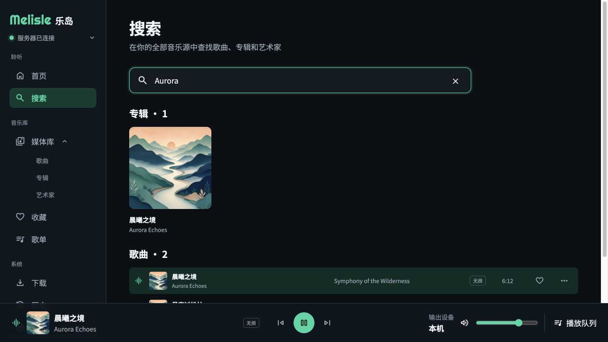
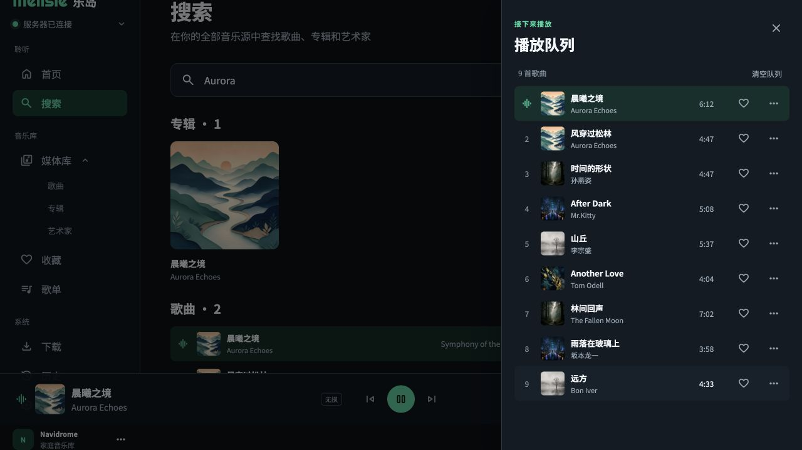
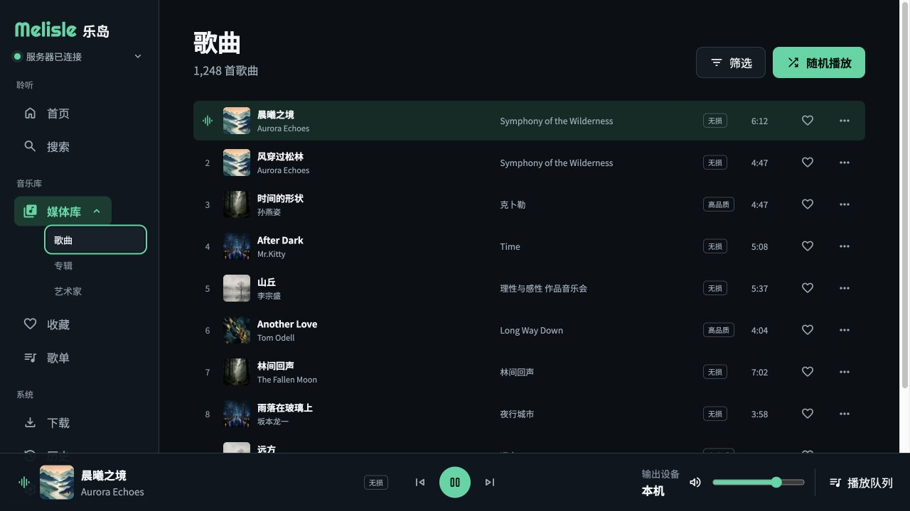

# Melisle 重新设计原型审查

审查日期：2026-08-28
审查范围：桌面端 1280×720、移动端 390×844；首页、搜索、歌曲媒体库、播放队列、独立播放器、设置页。
审查方式：实际操作原型，结合当前轮次截图与可见 DOM 结构进行 UX、视觉和可访问性联合审查。

## 总体结论

原型已形成清晰、成熟的音乐产品视觉语言。桌面与移动端不是简单缩放，而是做了导航、信息密度和控件布局的重排；首页、歌曲列表和独立播放器尤其完整。当前最需要优先解决的是桌面低高度视口中的固定播放器遮挡：在 1280×720 下，“历史”和“设置”落在播放器下方，鼠标点击会被播放器拦截。其次是筛选按钮无可见结果、抽屉语义与搜索清除按钮标签等交互和可访问性问题。

建议评级：视觉完成度 8.5/10；交互完整度 7/10；响应式 8/10；可访问性基础 6.5/10。

## 审查步骤

### 1. 首页 — 健康度：良好，但有桌面导航阻断

优点：首屏层级清楚，封面、标题、歌词与主要动作形成稳定阅读路径；最近播放和最新加入承接自然；固定播放器让核心控制始终可用。当前播放态同时使用均衡器图标和强调色，不依赖单一颜色。

问题：1280×720 下侧栏下部被固定播放器覆盖。“历史”部分覆盖，“设置”完全覆盖。对“设置”按钮做可点击性检查时，其中心位置最上层元素实际是底部播放器，点击结果会展开独立播放器，而不是进入设置。

建议：侧栏内容区的可用高度必须扣除播放器高度；将系统导航放进独立滚动容器，或把服务器卡片固定在播放器上方。增加 720px、768px、800px 高度的回归测试。

### 2. 搜索结果 — 健康度：良好

优点：搜索后按专辑和歌曲分组，结果数量明确；输入框位置、尺寸和反馈清晰；结果与全局播放器保持一致。

问题：清除输入内容的图标按钮在可访问性树中没有名称。键盘或读屏用户难以知道其作用。结果区的垂直留白偏大，歌曲区域在 720px 高度下很快进入播放器遮挡区，需要滚动才能看到完整列表。

建议：为清除按钮添加“清除搜索内容”标签；缩短专辑卡片到歌曲分组之间的空白，或在低高度桌面视口中采用更紧凑的结果布局。

### 3. 播放队列 — 健康度：良好，需补可访问性语义

优点：抽屉宽度、遮罩和层级关系明确；当前播放项与普通队列项容易区分；数量、清空、关闭和单曲操作都在合理位置。

问题：可见 DOM 中队列是 `complementary`，背景页面仍保留在可访问性树中，未体现模态对话框语义。截图无法确认焦点是否进入抽屉、Tab 是否被约束、Esc 是否关闭以及关闭后焦点是否返回触发按钮。

建议：若该抽屉是模态交互，使用 `dialog`、可访问标题和 `aria-modal`，实现焦点进入、焦点约束、Esc 关闭和焦点恢复；若非模态，则减少遮罩强度并允许清晰并行操作。

### 4. 独立播放器 — 健康度：优秀

优点：封面、同步歌词和控制区比例舒服，情绪感强；播放进度、总时长、随机、循环、歌词、音量和队列的控制关系完整；当前歌词使用尺寸、明度和颜色共同强调。

问题：顶部控制的图标依赖图形识别，截图无法确认焦点态、提示文本和键盘顺序。大面积模糊和渐变背景需要验证“减少动态效果”开启后是否同步减少转场和缩放。

建议：确保顶部返回和更多操作具有稳定的可访问名称与可见焦点；验证 200% 缩放和减少动态效果状态。

### 5. 歌曲媒体库 — 健康度：一般偏好

优点：桌面表格密度控制得好，当前播放、歌曲、艺术家、专辑、音质、时长和操作的阅读顺序自然；随机播放作为主要动作足够突出。

问题：点击“筛选”后没有出现筛选面板、菜单、条件或结果变化，只留下类似焦点/激活的描边状态。用户无法判断这是尚未实现、操作失败，还是筛选已经生效。

建议：点击后必须出现可见筛选界面，并通过 `aria-expanded`、面板标题和已选条件数量表达状态；尚未实现时不要让按钮看起来可用。

### 6. 移动端歌曲页 — 健康度：良好

优点：侧栏重构为底部五项导航；媒体库内部分类变为下拉选择；列表删减专辑、音质和时长列，保留封面、标题、艺术家和更多操作，信息取舍合理。迷你播放器与主导航分层清楚。

问题：筛选按钮仍处于描边激活状态但没有对应面板。滚动列表、迷你播放器和底部导航叠加后，底部需要足够安全区和内容内边距，截图中没有明显遮挡，但仍需在带 Home Indicator 的设备上验证。

建议：统一筛选状态逻辑，并使用 `env(safe-area-inset-bottom)` 处理设备安全区。

### 7. 移动端设置 — 健康度：良好

优点：设置按外观、播放、音乐源分组，标题、说明、选择器和开关形成稳定节奏；危险操作“断开当前音乐源”与普通设置区分合理。

问题：设置页顶栏的按钮可访问名称仍为“账户”，但图标已变为关闭图标，视觉含义与语义不一致。断开音乐源属于高影响操作，需要确认二次确认、结果反馈和恢复路径。

建议：关闭状态使用“关闭账户菜单”或更符合真实目的的标签；断开前提供说明和确认，完成后给出明确状态反馈。

## 优先级建议

1. P0：修复桌面低高度视口下播放器遮挡“历史”和“设置”的结构性问题。
2. P1：补全歌曲筛选交互，避免无反馈的可用控件。
3. P1：完善播放队列的对话框语义、焦点管理和键盘关闭。
4. P1：补搜索清除按钮的可访问名称，修正设置页顶栏图标与名称不一致。
5. P2：验证深色主题对比度、200% 缩放、减少动态效果和移动设备安全区。

## 证据边界

本轮确认了可见布局、响应式重排、部分点击结果和 DOM 可访问名称；未完成完整键盘遍历、读屏器实测、颜色对比度数值测量、音频播放质量、真实网络错误、空状态、加载态、断网态和破坏性操作确认流程。因此不能据此宣称满足完整 WCAG 要求。
